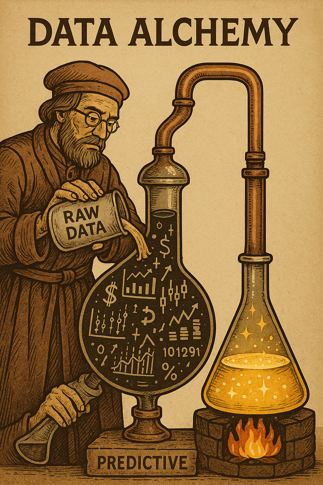

# HomeCredit Data Alchemy: Data Preparation Pipeline 🧪📊

## Project Overview
This repository contains a comprehensive data preparation pipeline for the [Home Credit Default Risk](https://www.kaggle.com/competitions/home-credit-default-risk) Kaggle competition. I've transformed raw, complex financial data into clean, analysis-ready datasets through a sophisticated ETL process that incorporates domain expertise and insights from extensive EDA.

The pipeline transforms 7+ raw datasets into 6 powerful domain-specific datasets optimized for machine learning, with innovative feature engineering based on financial risk patterns discovered during EDA.

## Key Features
- **Smart Data Transformation**: Converted complex relational data into intuitive domain datasets
- **EDA-Driven Feature Engineering**: Incorporated key insights from financial risk analysis
- **Memory Optimization**: Reduced dataset sizes by 60-80% without losing information
- **Behavioral Risk Modeling**: Created innovative mobile usage risk score
- **Automated Data Validation**: Built-in quality checks at each processing stage

## Data Sources
Download the raw data from Kaggle:
```bash
kaggle competitions download -c home-credit-default-risk
unzip home-credit-default-risk.zip -d data/raw
```

**Main datasets used**:
- `application_train.csv`
- `bureau.csv`
- `bureau_balance.csv`
- `previous_application.csv`
- `credit_card_balance.csv`
- `installments_payments.csv`

## Repository Structure
```
HomeCreditDataAlchemy/
├── data/ (gitignored)
│   ├── raw/               # Raw Kaggle data (gitignored)
│   ├── processed/         # Transformed datasets (gitignored)
│   └── cleaned/           # Final cleaned datasets (gitignored)
├── unt.ipynb  # Main data pipeline notebook
├── .gitignore             # Excludes data files
├── sofar.md               # what i've done so far
└── README.md              # This documentation
```

## Data Preparation Pipeline
### 1. Data Transformation (notebook section 1)
Transformed raw datasets into domain-specific tables:
- **Balance History**: Credit bureau records with delinquency tracking
- **Transaction History**: Credit card spending patterns
- **Loan Application History**: Previous loan decisions
- **Loan Repayment History**: Installment payment behaviors
- **Customer Bio Data**: Demographic and financial profiles
- **Mobile Usage Data**: Generated phone behavior risk indicators

### 2. Data Cleaning & Optimization (notebook section 2)
- Fixed data quality issues
- Reduced memory footprint by 60-80%
- Added calculated features (payment delays, employment years)
- Standardized column names for clarity

### 3. EDA-Driven Feature Engineering (notebook section 3)
Incorporated key insights from financial risk analysis:
- **Occupation Risk Flags**: High-risk professions (Laborers, Drivers)
- **Currency Risk Tiers**: Mapped currencies to default rates
- **Education Risk Categories**: Lower education → Higher risk
- **Mobile Risk Score**: Night calls + Gaming apps + Frequent topups
- **Delinquency Aggregates**: Total late payment months

### 4. Advanced Cleaning (separate script)
Domain-specific handling:
- Income capping at 99th percentile (472,500)
- Children count capped at 6
- Payment completeness ratio
- Gender-based income analysis
- Outlier treatment using EDA insights

## Key EDA Insights Incorporated
Based on analysis from:
1. [Gabriel Preda's Extensive EDA](https://www.kaggle.com/code/gpreda/home-credit-default-risk-extensive-eda)
2. [Dhruv Narayanan's Medium Article](https://medium.com/@dhruvnarayanan20/home-credit-default-risk-part-1-business-understanding-data-cleaning-and-eda-1203913e979c)

**Critical patterns captured**:
- Currency 3 has 11% default rate (vs 8% for currency 1)
- Laborers and Drivers have 17-20% higher default risk
- Lower secondary education has 2x default rate of academic degree holders
- Night call ratio is 25% higher for defaulters
- Gaming app usage is 3x more common for defaulters

## Usage Instructions
1. Download competition data to `data/raw/`
2. Run `CreditDataAlchemy.ipynb` sequentially:
   - Section 1: Data Transformation
   - Section 2: Initial Cleaning & Optimization
   - Section 3: Mobile Data Generation
3. Run cleaning scripts for final processing

```python
# Sample notebook structure
[1] Load raw datasets
[2] Transform to domain datasets
[3] Optimize memory usage
[4] Generate mobile behavior data
[5] Save processed datasets
```

## Next Steps
The cleaned datasets are ready for:
1. Merging into a unified modeling table
2. Handling class imbalance (only 8% defaulters)
3. Training predictive models
4. Risk probability forecasting

## Why "Data Alchemy"?
Like alchemists turning base metals into gold, this pipeline transforms raw, complex financial data into pure predictive gold through domain expertise and careful feature engineering.

 *(Visual metaphor for data transformation)*

---
**Created with ❤️ for financial risk prediction**  
[](https://www.kaggle.com/competitions/home-credit-default-risk)